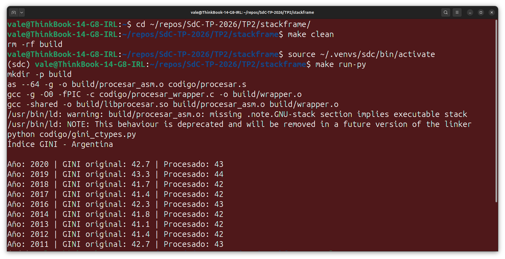
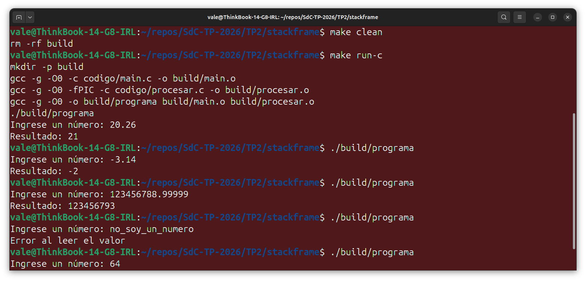
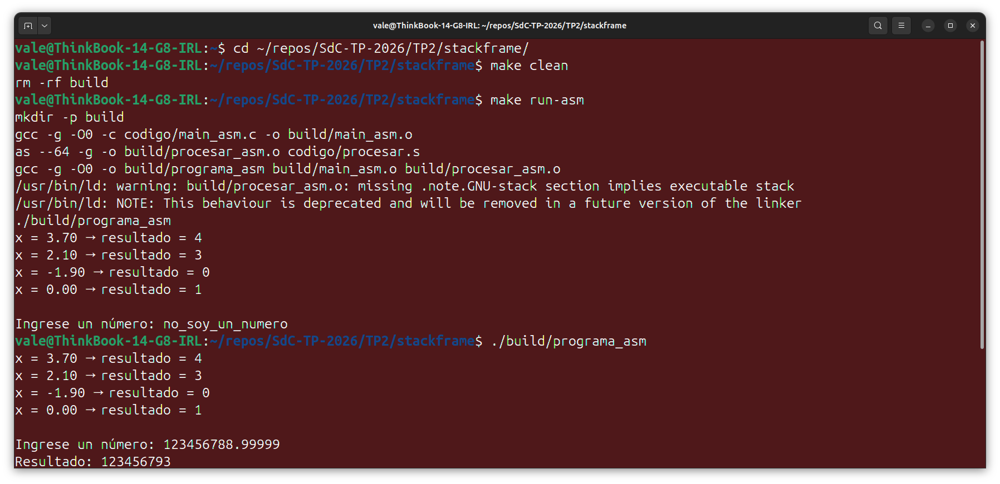
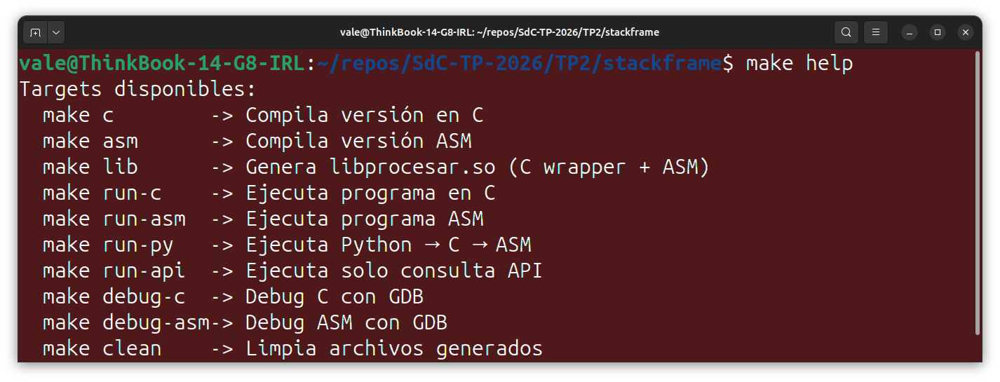

# TRABAJO PRÁCTICO N° 2  
## Stackframe - Calculadora de Índice GINI

**Integrantes:**
- García, Lautaro Misael
- Gomez, Dolores
- Renaudo Gaggioli, Valentino

**Abril 2026**


---

## 1. Introducción

El objetivo de este trabajo práctico es implementar un sistema que integre distintos niveles de software, utilizando C y ensamblador, con el fin de comprender el funcionamiento del stack y las convenciones de llamada entre funciones.

Se plantea la resolución en dos etapas:
- Implementación completa en C
- Migración de la lógica a ensamblador

---

## 2. Objetivos

### Objetivo general

Comprender el uso del stackframe y la interacción entre lenguajes de alto y bajo nivel.

### Objetivos específicos

- Implementar procesamiento de datos en C
- Utilizar convenciones de llamada
- Implementar funciones en assembler
- Analizar el stack mediante GDB

---

## 3. Arquitectura del sistema

El sistema se compone de las siguientes capas:

- Python (opcional): obtención de datos desde API
- C: control del flujo del programa
- Assembler: procesamiento de datos

Flujo general:

```text
Python → C → ASM → Resultado
```

### Integración Python - C - ASM

Para la integración entre lenguajes se utilizó la biblioteca `ctypes` de Python, que permite cargar librerías dinámicas (`.so`).

Se implementó un wrapper en C que actúa como intermediario entre Python y la rutina en ensamblador.

Firma de la función:

```c
int procesar_wrapper(float x);
```

Desde Python:

```python
lib.procesar_wrapper.argtypes = [ctypes.c_float]
lib.procesar_wrapper.restype = ctypes.c_int
```



---

## 4. Iteración 1 - Implementación en C

En esta primera iteración se desarrolló la lógica completa en lenguaje C con el objetivo de validar el funcionamiento del sistema antes de migrar a ensamblador.

La función principal `procesar` recibe un valor de tipo `float`, realiza un truncamiento hacia cero para convertirlo a entero y luego incrementa el resultado en una unidad.

Esta implementación permite verificar el comportamiento esperado de manera sencilla, aprovechando la abstracción del lenguaje C.

### Descripción

- Recepción de datos
- Conversión de float a entero
- Incremento del valor en 1

### Implementación

Se implementó la función:

```c
int procesar(float x) {
    int valor = (int)x; // truncamiento
    return valor + 1;
}
```

Se validó mediante un programa en C que solicita datos por consola.

### Ejecución en C



---

## 5. Iteración 2 - Implementación en Assembler

### Descripción

En esta iteración se reemplazó la implementación en C por una versión equivalente en ensamblador para arquitectura x86-64, manteniendo la misma interfaz de la función.

El objetivo fue comprender cómo se implementan operaciones simples a bajo nivel y cómo se respetan las convenciones de llamada del sistema.

Se utilizó la convención System V AMD64 ABI, donde:

El argumento `float` se recibe en el registro `%xmm0`  
El valor de retorno (`int`) se devuelve en `%eax`

### Código relevante

```asm
# procesar.s
cvttss2si   %xmm0, %eax
addl        $1   , %eax
ret
```

### Instrucciones usadas

[cvttss2si](https://www.felixcloutier.com/x86/cvttss2si): convierte un float a entero truncando hacia cero  
[addl](https://www.felixcloutier.com/x86/add): suma un valor inmediato al registro  
[ret](https://www.felixcloutier.com/x86/ret): retorna al programa llamador  

### Ejecución en ASM



Se observó que para valores grandes con decimales, el resultado difiere del esperado debido a la precisión limitada del tipo float (32 bits). 
Esto se debe a la representación binaria aproximada de números reales.

---

## 6. Stackframe y convención de llamadas

### Paso de parámetros

En esta implementación:

- Argumentos float → `xmm0`
- Retorno entero → `eax`

Esto se verificó mediante GDB.

---

## 7. Debug y análisis con GDB

### Metodología

Se utilizó GDB para:

- establecer breakpoints
- ejecutar instrucción por instrucción (`stepi`)
- inspeccionar registros

Se documentó el análisis completo del stackframe y registros en el siguiente informe:
[Informe de debug en GDB](./stackframe/debug/informe_gdb.pdf)

---

## 8. Sistema de compilación

Se utilizó un Makefile para automatizar:

- compilación en C
- ensamblado
- generación de librería compartida
- ejecución con Python

Comando principal:

```bash
make run-py
```




---

## 9. Conclusión

Se implementó un flujo completo que integra Python, C y ensamblador, permitiendo analizar cómo se ejecuta una función desde alto hasta bajo nivel. La versión en C sirvió para validar la lógica, mientras que la implementación en ASM permitió trabajar directamente con registros y comprender el pasaje de parámetros según la convención **System V AMD64 ABI**.

La integración mediante `ctypes` mostró cómo reutilizar código compilado desde Python, introduciendo una capa intermedia en C que encapsula la rutina en ensamblador. A su vez, el uso de GDB permitió verificar el comportamiento interno del programa, inspeccionando registros y confirmando la correcta ejecución de las instrucciones.

Finalmente, se observaron limitaciones asociadas al uso de `float`, evidenciando errores de precisión propios de su representación. En conjunto, el trabajo permitió vincular conceptos teóricos con su implementación práctica en distintos niveles del sistema.
