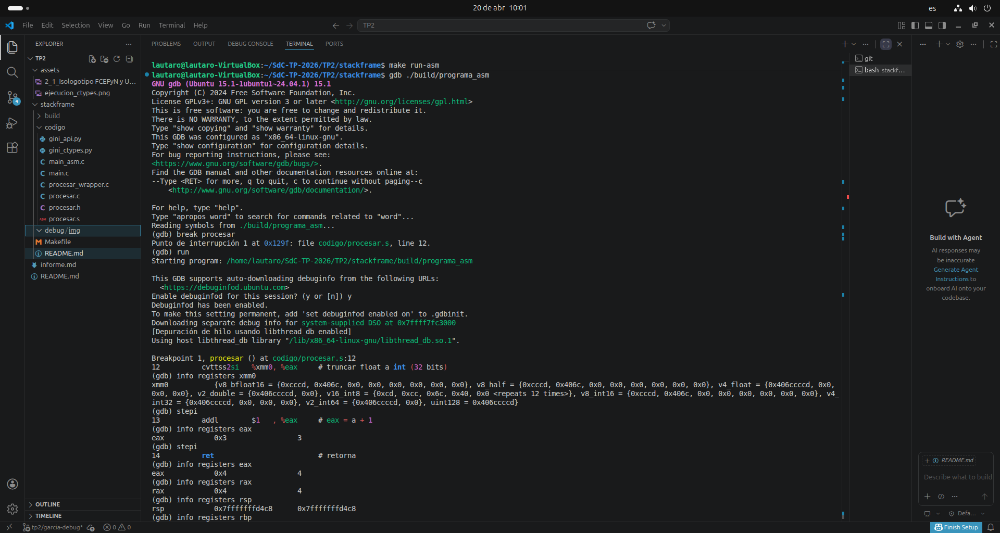

# Debug GDB - función procesar

## Objetivo
Verificar el paso de parámetros y retorno usando GDB.

## Desarrollo

Se ejecutó el programa en GDB colocando un breakpoint en la función `procesar`.

Se observó que:

- El argumento float se recibe en el registro `xmm0`
- Se utilizó `stepi` para ejecutar instrucción por instrucción
- La instrucción `cvttss2si` convierte el valor de float a entero
- Luego se realiza la suma +1 con `addl`
- El resultado final se obtiene en el registro `eax` (y `rax`)

## Evidencia

