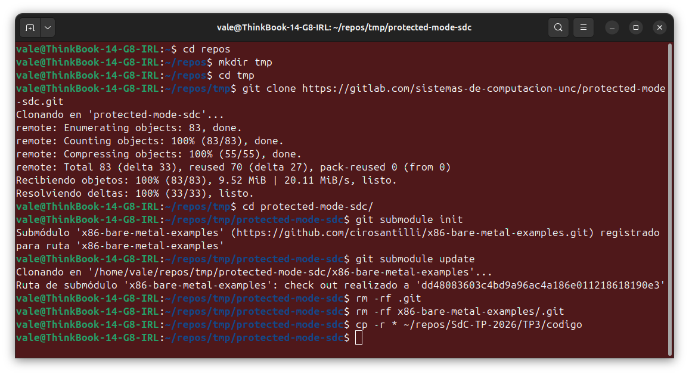
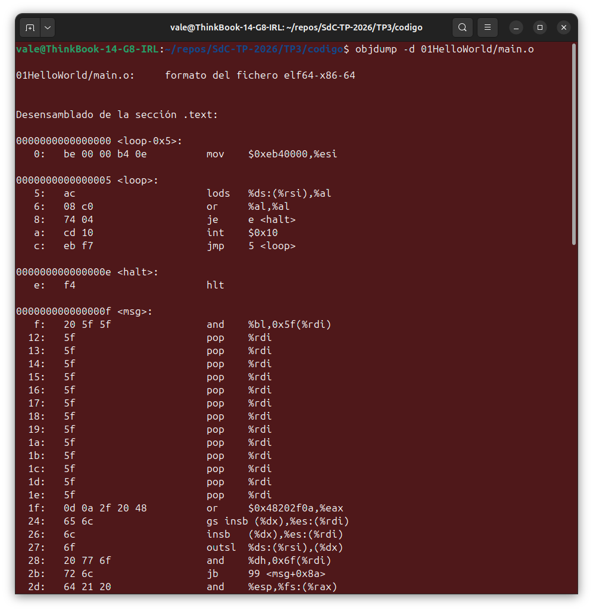
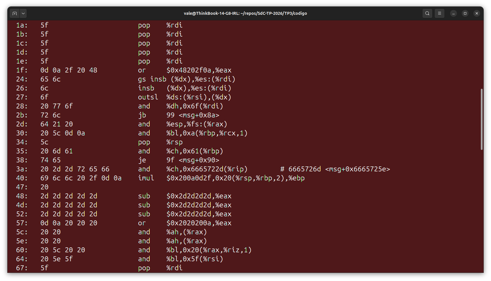
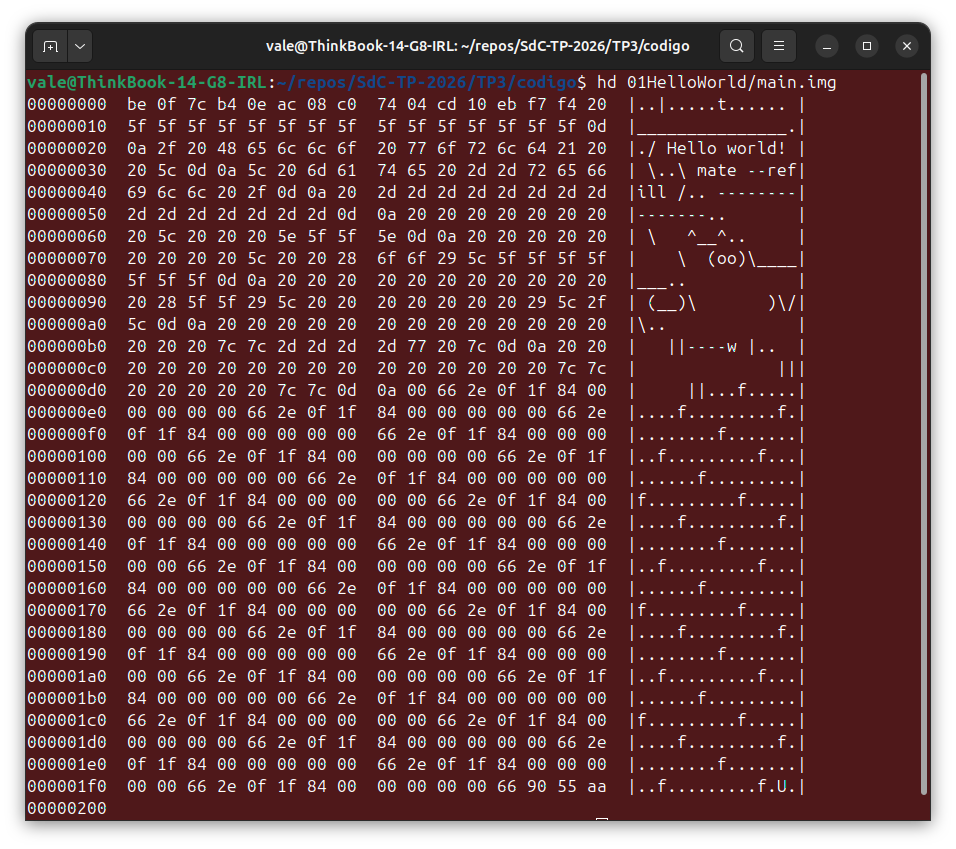
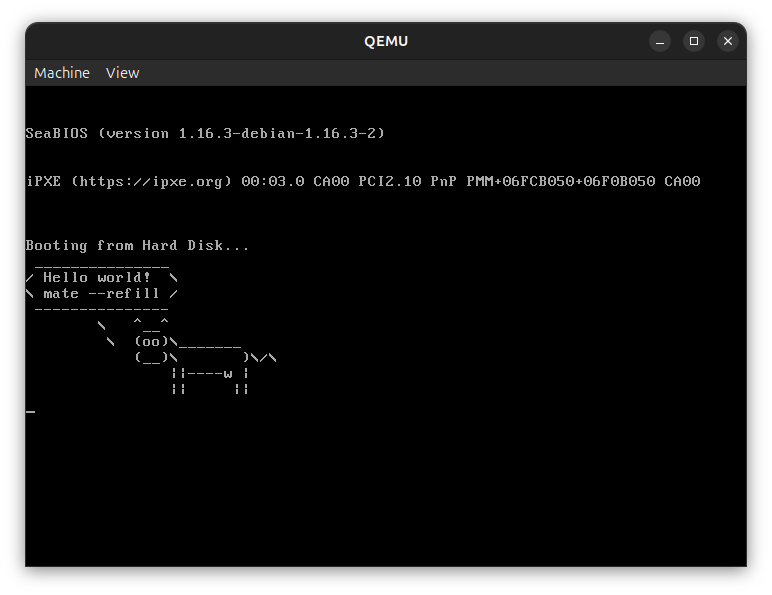
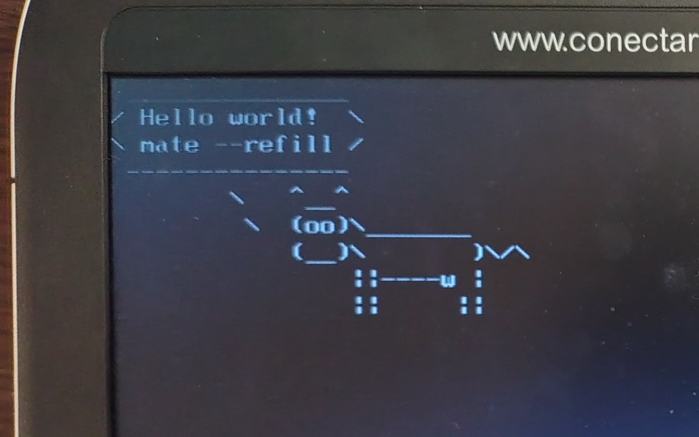

# TRABAJO PRÁCTICO N° 3  
## Modo Protegido

**Integrantes:**
- García, Lautaro Misael
- Gomez, Dolores
- Renaudo Gaggioli, Valentino

**Abril 2026**

---

## Desafío UEFI

### UEFI

UEFI es la especificación que define la interfaz entre el firmware del hardware y el sistema operativo. Es lo primero que se ejecuta al encender la PC, antes que cualquier SO, y reemplaza al viejo BIOS que se usó durante décadas.

El BIOS quedó obsoleto porque operaba en 16 bits, no soportaba discos mayores a 2.2 TB, tenía arranque lento y sin ningún mecanismo de seguridad. UEFI resuelve todo eso: trabaja en 32/64 bits, soporta discos enormes con GPT, paraleliza la inicialización del hardware para arrancar más rápido, implementa Secure Boot para verificar firmas digitales, y tiene soporte nativo de drivers, red e interfaz gráfica.

El proceso de arranque está dividido en fases. SEC usa el cache de la CPU como RAM temporal antes de que la memoria esté disponible. PEI inicializa la RAM y el chipset. DXE carga todos los drivers modulares (USB, disco, GPU, red). BDS elige el dispositivo de arranque y aplica Secure Boot. Finalmente RT mantiene algunos servicios activos mientras el sistema operativo está corriendo.

UEFI expone dos grupos de servicios: los Boot Services, que solo existen antes de que el SO tome el control, y los Runtime Services, que persisten después. El más usado es GetVariable/SetVariable, que permite leer y escribir variables persistentes en la NVRAM como el orden de arranque o el estado de Secure Boot.

### Vulnerabilidades UEFI

El firmware UEFI es un objetivo muy valioso para atacantes porque se ejecuta antes del sistema operativo, es invisible para los antivirus, y sobrevive a formateos y reinstalaciones completas.

**LoJax (2018)** fue el primer rootkit UEFI usado en ataques reales, operado por APT28 (GRU ruso). Los atacantes leyeron el contenido de la flash SPI, insertaron un módulo DXE malicioso en la imagen del firmware y la reescribieron. Desde entonces, en cada arranque el módulo se cargaba antes del SO e instalaba malware. Sobrevive incluso al reemplazo físico del disco.

**MosaicRegressor (2020)**, atribuido a un APT norcoreano, hacía algo similar pero insertaba un módulo completamente nuevo en el firmware que descargaba componentes adicionales desde internet al iniciar el sistema.

**CosmicStrand (2022)** afectaba placas ASUS y Gigabyte con chipset H81. En lugar de tocar el disco, modificaba directamente la rutina de transferencia al kernel de Windows para inyectar código malicioso antes de que cualquier mecanismo de seguridad del SO estuviera activo.

**BlackLotus (2023)** fue el primer bootkit vendido públicamente capaz de bypassear Secure Boot en Windows 11 actualizado, explotando CVE-2022-21894. Usaba un gestor de arranque legítimamente firmado pero vulnerable que Secure Boot aceptaba sin problema, y desde ahí deshabilitaba Defender, BitLocker y VBS.

**LogoFAIL (2023)** explotó vulnerabilidades en los parsers de imágenes que UEFI usa para mostrar logos de marca al arrancar. Un atacante podía colocar una imagen maliciosa en la EFI System Partition y lograr ejecución de código antes de que Secure Boot actuara, ya que esa verificación ocurre fuera de su alcance.

### Intel CSME y MEBx

El CSME es un microprocesador independiente integrado en el chipset de los sistemas Intel. No tiene nada que ver con el procesador principal: tiene su propia CPU, su propia RAM, su propio sistema operativo embebido y opera incluso cuando el equipo está apagado, siempre que haya tensión de standby. Tiene acceso directo a la red, a la memoria del sistema y al almacenamiento.

Sus funciones principales son Intel Boot Guard (verifica que el firmware UEFI no fue modificado antes de que arranque), Intel AMT (administración remota fuera de banda, incluso con el SO apagado), Intel PTT (TPM 2.0 por software, sin necesidad de chip físico separado) y servicios criptográficos varios.

En cuanto a vulnerabilidades: CVE-2017-5689 permitía autenticarse en la interfaz web de AMT enviando una contraseña vacía, afectando millones de equipos empresariales. CVE-2019-0090 estaba en la ROM de arranque del CSME y no era parcheable por software, permitiendo comprometer toda la cadena de confianza del sistema incluyendo Boot Guard.

El MEBx es la interfaz de configuración del CSME, accesible antes del arranque con Ctrl+P. Permite habilitar o deshabilitar AMT, cambiar su contraseña (que por defecto es "admin"), configurar su red independiente y habilitar acceso KVM remoto. En 2017, F-Secure demostró que con acceso físico de menos de 30 segundos y la contraseña por defecto, se puede establecer una backdoor de acceso remoto permanente que sobrevive a cualquier reinstalación del SO y es invisible para el sistema operativo.

### Coreboot

Coreboot es un proyecto de firmware open source bajo licencia GPLv2 cuyo objetivo es reemplazar el firmware propietario con el mínimo de código necesario para inicializar el hardware, y luego pasar el control a un payload modular (GRUB, SeaBIOS, TianoCore, Linux, etc.).

Su arquitectura es simple: bootblock arranca desde la ROM, romstage inicializa la RAM, ramstage detecta y configura el hardware completo, y el payload se encarga del resto.

Las ventajas frente al firmware propietario son concretas. Al ser código abierto, puede auditarse en busca de backdoors o vulnerabilidades. Al ser minimal, tiene menos superficie de ataque. El tiempo de arranque puede bajar a menos de un segundo. Algunas configuraciones permiten neutralizar el CSME de Intel con herramientas como me\_cleaner, eliminando esa superficie de ataque completamente.

En cuanto a adopción comercial: todos los Chromebooks de Google desde 2012 usan Coreboot, lo que lo convierte en el firmware open source más desplegado del mundo. Framework Laptop lo usa en sus modelos AMD. Purism lo incluye junto con Heads para máxima seguridad. System76 está migrando sus laptops a Coreboot bajo el proyecto Open Firmware. Los appliances Protectli Vault también lo usan. Y Facebook/Meta lo implementó en sus servidores del Open Compute Project.

---

## Desafío Linker

### Teoría del Linker
El **linker** (o enlazador) es una herramienta que toma uno o más archivos objeto generados por el compilador o ensamblador y los combina en un único archivo **ejecutable**. Se encarga de ubicar las secciones (como `.text` para código o `.data` para datos) y resolver las direcciones de los símbolos.

Normalmente, un linker genera archivos ejecutables con un formato específico para un sistema operativo, los cuales incluyen metadatos o "cabeceras" que que le dicen al sistema operativo dónde debe cargarse en memoria. Sin embargo, utilizamos la opción `--oformat binary` porque estamos programando sin sistema operativo. Necesitamos generar **código máquina puro** (binario crudo), sin cabeceras, para que la BIOS/UEFI pueda cargarlo directamente en memoria y ejecutarlo como un sector de arranque. Al exportar en formato **binario crudo**, toda esa información de cabecera se elimina. Obtenemos únicamente una "imagen de memoria" exacta de los bytes que deben cargarse, perdiendo la información explícita de la dirección de inicio. Por lo tanto, el código máquina generado debe estar pre-calculado por el linker para funcionar asumiendo una dirección base específica.

### El Script del Linker (`link.ld`)

El **Linker Script** controla explícitamente cómo se mapeará nuestro programa, supliendo la falta de metadatos del archivo binario. Dentro del script, la variable `.` representa el **Location Counter** (contador de posición). Observamos que se le indica que coloque la sección de código (`.text`) a partir de la dirección física `0x7C00`, mediante la instrucción: `. = 0x7C00`.    

Esta dirección es usada por una convención histórica de la arquitectura x86, cuando la PC arranca, la BIOS busca un dispositivo booteable, lee su primer sector (los primeros 512 bytes) y lo copia exactamente en la dirección de memoria RAM `0x0000:0x7C00`. Luego, el procesador hace un salto a esa dirección para comenzar a ejecutar el código.

Además, el script permite usar el Location Counter para forzar que los últimos dos bytes del sector (desplazamientos `0x1FE` y `0x1FF`) contengan la firma mágica `0x55` y `0xAA`.

### El origen del `0x7C00`

La dirección `0x7C00` es una herencia directa del equipo de desarrollo de la **IBM PC 5150** (1981). En aquel entonces, la memoria mínima requerida para correr DOS 1.0 era de **32 KiB** (`0x8000`). El equipo de BIOS decidió ubicar el sector de arranque lo más lejos posible de la zona inicial para dejarle espacio contiguo al Sistema Operativo.
El cálculo fue simple:
* La BIOS ocupaba la parte baja con vectores de interrupción (`0x0 - 0x3FF`) y su área de datos se ubicaba a continuación.
* Se necesitaban 512 bytes para el *Master Boot Record* (MBR) y otros 512 bytes para la pila y datos del bootloader.
* Total requerido para el arranque: **1024 bytes (`0x400`)**.

Entonces se eligieron los últimos 1024B. Si restamos a los 32 KiB el espacio del bootloader: `0x8000 - 0x400 = 0x7C00`.

Desde entonces, por compatibilidad hacia atrás, cualquier BIOS x86 copia el primer sector del disco a la dirección `0x7C00` y salta hacia ella para ceder el control.

### Preparación del Entorno y Submódulos

Siguiendo las instrucciones de la cátedra, el primer paso para la resolución de este trabajo práctico consistió en obtener el código base y los ejemplos provistos. Para ello, clonamos el repositorio oficial de la materia e inicializamos el submódulo correspondiente a los ejemplos *bare-metal* (repositorio de Ciro Santilli). 

Esto se logró mediante los comandos de inicialización y actualización de submódulos en Git:



Una vez desvinculado del historial original para evitar conflictos, este código fue integrado a la carpeta `codigo/` de nuestro repositorio grupal para facilitar el trabajo colaborativo. Modificamos la copia para incluir nuesto mensaje personalizado, la salida del comando `cowsay -W 14 Hello world! mate --refill`:

```
msg:
    .ascii " _______________\r\n"
    .ascii "/ Hello world!  \\\r\n"
    .ascii "\\ mate --refill /\r\n"
    .ascii " ---------------\r\n"
    .ascii "        \\   ^__^\r\n"
    .ascii "         \\  (oo)\\_______\r\n"
    .ascii "            (__)\\       )\\/\\\r\n"
    .ascii "                ||----w |\r\n"
    .asciz "                ||     ||\r\n"
```

### Análisis del Archivo Objeto (`objdump`)

Al ejecutar `objdump -d 01HelloWorld/main.o`, observamos el código desensamblado antes de que el linker asigne las direcciones finales.



**Hallazgos técnicos:**
* **Direcciones Relativas:** En esta etapa, el programa comienza en la dirección `00000000`. Esto se debe a que el ensamblador genera código relativo; es el Linker quien debe "reubicar" estas instrucciones.
* **Interpretación de Datos:** Un detalle muy interesante es que `objdump` es incapaz de distinguir entre código ejecutable y datos puros. Como resultado, intenta decodificar el string ASCII de nuestro dibujo (el *cowsay* con la frase "Hello World! mate --refill") como si fuesen instrucciones x86. 

A continuación, destacamos el fragmento exacto donde nuestro texto se muestra como código ensamblador:



Si analizamos los códigos hexadecimales de estas instrucciones, podemos leer nuestro mensaje. Por ejemplo:
  * En la dirección `19 y 24:`, los bytes `48 65 6c 6c 6f` corresponden a **"Hello"**, interpretados como `gs insb`.
  * En la dirección `35:`, los bytes `6d 61 74 65` corresponden a **"mate"**, interpretados como un `and`.
  * En la dirección `3a:`, los bytes `2d 2d 72 65 66...` forman nuestro nombre de grupo **"--refill"**, siendo leídos como otro `and` e `imul`.

### Verificación de la Imagen Final (`hexdump`)

Una vez vinculado el código con `ld --oformat binary`, generamos `main.img`. Usamos `hd 01HelloWorld/main.img` para verificar la estructura cruda del binario.



**Puntos clave verificados:**
* **Firma de Booteo:** Al final del sector (`0x1FE` y `0x1FF`), verificamos la presencia de los bytes `55 aa`. Sin esta firma obligatoria, la BIOS no reconocería el disco como un medio booteable.
* **Padding Inteligente (Instrucciones NOP):** El linker rellenó el espacio entre el final de nuestro código y la firma de booteo para asegurar que el archivo pese exactamente 512 bytes. Sin embargo, **no rellenó con ceros**. Como estamos dentro de la sección ejecutable (`.text`), rellenó utilizando secuencias de instrucciones **NOP (No Operation) de múltiples bytes** (la secuencia `66 2e 0f 1f...` y `66 90`). Esto es una medida de seguridad de los linkers, ya que el byte `00` se interpreta como la instrucción `ADD`, lo que podría causar fallos de memoria si el flujo de ejecución cayera allí. Los NOPs garantizan que el procesador no haga nada dañino en ese espacio libre.

### Ejecución en Emulador (QEMU)

Finalmente, probamos la imagen en QEMU. El resultado muestra nuestra "vaca" saludando, lo que confirma que el bucle de impresión y las interrupciones de video del BIOS (`int 0x10`) están funcionando correctamente en modo real de 16 bits.



### Prueba en Hardware Real

Para comprobar que nuestra imagen es un sector de arranque válido más allá del emulador, grabamos el archivo `main.img` en un pendrive físico utilizando el comando `dd`.



---

## Desafío Modo Protegido