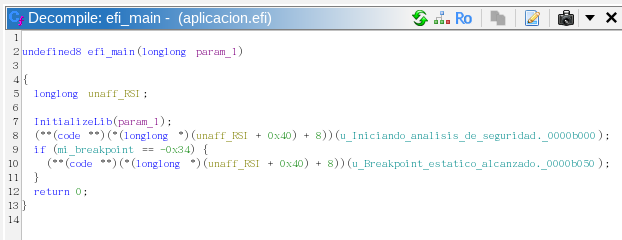
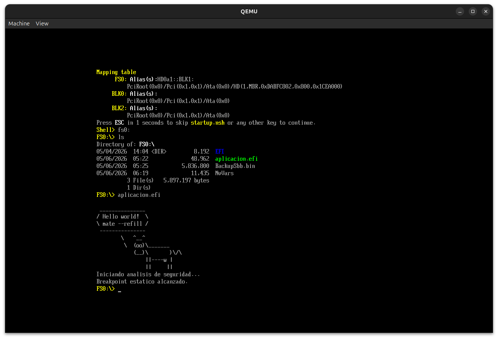
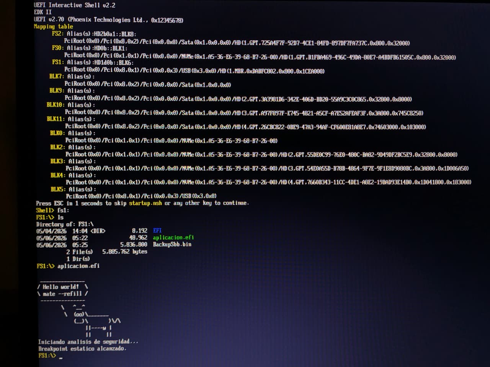

# TRABAJO PRÁCTICO N° 3a  
## Interfaz de Firmware Extensible Unificada (UEFI)

**Integrantes:**
- García, Lautaro Misael
- Gomez, Dolores
- Renaudo Gaggioli, Valentino

**Mayo 2026**

---

## Introducción

---


## TP 1: Exploración del entorno UEFI y la Shell

En este trabajo se exploró el entorno UEFI utilizando QEMU con firmware OVMF. Se analizaron dispositivos, memoria, variables NVRAM y la arquitectura basada en handles y protocolos.

Se utilizó QEMU junto con OVMF para simular un entorno UEFI:   
`qemu-system-x86_64 -m 512 -bios /usr/share/ovmf/OVMF.fd -net none`

### Exploración del sistema

#### Dispositivos

Comando: `map`


Se observó la presencia de dispositivos de tipo BLK, sin sistemas de archivos montados (FS), lo que evidencia que UEFI no asume automáticamente la existencia de particiones accesibles.

#### Handles y Protocolos

Comando: `dh -b`


Se verificó que UEFI utiliza un modelo basado en handles y protocolos para representar dispositivos y servicios, en lugar de direcciones de hardware fijas.

#### Variables NVRAM

Comando: `dmpstore -b`


Se analizaron variables como `BootOrder` y `Boot####`, observando que el orden de arranque se define mediante un arreglo de identificadores almacenado en formato binario.

Ejemplo observado: `00 00 01 00`

Interpretación:

- Boot0000
- Boot0001

#### Memoria

Comando: `memmap -b`


Se identificaron regiones como `RuntimeServices`, las cuales permanecen activas incluso después de que el sistema operativo toma control.

#### Drivers

Comando: `drivers -b` 


Se observó que el firmware UEFI está compuesto por múltiples módulos (drivers), evidenciando una arquitectura modular.

---

**Pregunta de Razonamiento 1:**

*Pregunta de Razonamiento 1: Al ejecutar el comando map y dh, vemos protocolos e identificadores en lugar de puertos de hardware fijos. ¿Cuál es la ventaja de seguridad y compatibilidad de este modelo frente al antiguo BIOS?*

  > El modelo de UEFI basado en handles y protocolos actúa como un "middleware" que abstrae por completo el hardware físico. En el BIOS Legacy, el código dependía de interrupciones rígidas y accesos a puertos de I/O específicos (hardcodeados), lo que generaba conflictos y ataba el software a una arquitectura específica. Con UEFI, se interactúa a través de interfaces estandarizadas y orientadas a objetos. Esto no solo garantiza la portabilidad entre distintas plataformas (x86, ARM), sino que a nivel de seguridad es vital: obliga a cualquier driver o aplicación a pasar por APIs controladas y validadas por el firmware, evitando accesos directos y arbitrarios a recursos críticos del hardware.

**Pregunta de Razonamiento 2:**

*Observando las variables `Boot####` y `BootOrder`, ¿cómo determina el Boot Manager la secuencia de arranque?*

  > El Boot Manager determina la secuencia de arranque utilizando la variable `BootOrder`, que contiene una lista ordenada de identificadores. Cada uno corresponde a una variable `Boot####`, que incluye un Device Path hacia el ejecutable `.efi`. El firmware recorre esta lista secuencialmente; si una opción falla o el dispositivo no está presente, pasa automáticamente al siguiente identificador hasta lograr transferir el control, eliminando la vieja e insegura práctica del BIOS de ejecutar a ciegas el primer sector (MBR) del disco.

**Pregunta de Razonamiento 3:**

*En el mapa de memoria (`memmap`), existen regiones marcadas como `RuntimeServicesCode`. ¿Por qué estas áreas son un objetivo principal para los desarrolladores de malware (Bootkits)?*

  > Las regiones `RuntimeServices` permanecen accesibles después del arranque del sistema operativo, lo que las convierte en un objetivo crítico para ataques como bootkits. Estas permiten mantener código con altos privilegios y dificultan su detección desde el sistema operativo.

---

## TP 2: Desarrollo, Compilación y Análisis de Seguridad

### Desarrollo de la Aplicación UEFI
Se desarrolló una aplicación nativa en C (`aplicacion.c`) que utiliza la tabla de sistema para imprimir en consola y contiene un breakpoint estático (`INT3`).

**Pregunta de Razonamiento 4:**

*¿Por qué utilizamos `SystemTable->ConOut->OutputString` en lugar de la función `printf` de C?*

  > Se debe a que estamos desarrollando para un entorno de pre-arranque o freestanding (compilado con la bandera `-ffreestanding`). La función `printf` pertenece a la biblioteca estándar de C (`libc`), la cual asume y requiere que haya un Sistema Operativo ejecutándose por debajo para proveer llamadas al sistema que envíen los caracteres a la pantalla.
  >
  > Al ejecutar una aplicación UEFI, el Sistema Operativo aún no existe en memoria. Por lo tanto, no contamos con `libc`. Para imprimir en pantalla, debemos interactuar directamente con la API que nos provee el firmware a través de la Tabla de Sistema (`SystemTable`), utilizando el protocolo de salida de texto simple (`ConOut`) para enviar cadenas de caracteres Unicode (`L"..."`) nativas del entorno UEFI.

### Proceso de Compilación y Automatización
Para la generación del binario `.efi`, se utilizó un script de automatización `build.sh` que realiza los siguientes pasos:
1. Compilación a código objeto con `gcc` (flags: `-fpic`, `-ffreestanding`, etc.).
2. Enlace con `ld` utilizando el script de linker de EFI.
3. Conversión de formato con `objcopy` a `efi-app-x86_64`.


### Análisis con Ghidra

Se importó el binario `aplicacion.efi` en Ghidra para analizar la lógica de seguridad y el comportamiento de los opcodes.

**Captura de pantalla:**  


**Pregunta de Razonamiento 5:**

*En el pseudocódigo de Ghidra, la condición `0xCC` suele aparecer como `-52`. ¿A qué se debe este fenómeno y por qué importa en ciberseguridad?*

  > **El fenómeno -52:** Se debe a un problema de interpretación de signos. El valor hexadecimal `0xCC` en binario es `1100 1100`. El motor de decompilación de Ghidra asume que las variables de 1 byte son del tipo con signo (`signed char`), lee el bit más significativo como el bit de signo negativo. Al aplicar la regla del complemento a dos para 8 bits, el valor lógico de `1100 1100` resulta en el número decimal `-52`.
  > 
  > **Importancia en Ciberseguridad:** El valor `0xCC` corresponde a la instrucción `INT3`, que se utiliza para establecer software breakpoints reemplazando el código en la dirección objetivo y generando la excepción `EXCEPTION_BREAKPOINT`. El malware escanea activamente la memoria en busca del byte `0xCC` para detectar si el código está siendo analizado por un depurador, permitiéndole evadir el análisis (técnicas anti-debugging).

**Nota:** Para lograr que el descompilador mostrara el chequeo, fue necesario declarar la variable como volatile en el scope global, forzando a las herramientas a leer la memoria asumiendo que un agente externo o hardware podría haberla modificado.

```C
#include <efi.h>
#include <efilib.h>

// DECLARACIÓN GLOBAL Y VOLÁTIL
volatile unsigned char mi_breakpoint = 0xCC;

EFI_STATUS efi_main(...) { ... }
```

---

## TP 3: Ejecución en Hardware Físico (Bare Metal)

Esta sección documenta el procedimiento para preparar el medio de arranque, validarlo en un entorno virtual y ejecutarlo en hardware físico. Además, se detalla una refactorización crítica del código debida a incompatibilidades a nivel de arquitectura.

### Refactorización del Código y Análisis del Fallo de `OutputString`
En la propuesta original de la cátedra, se sugería utilizar el protocolo nativo de UEFI para imprimir texto en pantalla mediante la siguiente instrucción:

`SystemTable->ConOut->OutputString(SystemTable->ConOut, L"Mensaje\r\n");`

Durante las pruebas, se comprobó que esta instrucción **provocaba un cuelgue total (congelamiento) del sistema**, tanto en el emulador como en el hardware físico. Por este motivo, se optó por refactorizar el código utilizando la función de alto nivel `Print(L"Mensaje\r\n");` (el código fuente actualizado puede consultarse en el repositorio).

**Investigación del fallo (ABI Mismatch):**
El problema no radica en un error de sintaxis, sino en una incompatibilidad a nivel de la Interfaz Binaria de Aplicación y la Convención de Llamadas:
1. **El estándar UEFI** fue desarrollado con gran influencia de Microsoft, por lo que utiliza la **Microsoft x64 Calling Convention**. En este estándar, los primeros argumentos de una función se pasan a través de los registros `RCX` y `RDX` del procesador.
2. **Nuestro entorno de compilación** utiliza `gcc` en Linux, el cual asume por defecto la convención **System V AMD64 ABI**. Aquí, los primeros argumentos se pasan en los registros `RDI` y `RSI`.

Al compilar nuestro código en Linux e intentar ejecutar la llamada directa a `OutputString`, nuestro binario guarda los punteros del texto en `RDI`. Sin embargo, el firmware de UEFI va a buscar esos punteros a `RCX` (donde en ese momento hay basura o ceros). Esto provoca que el procesador intente leer memoria inválida, generando una excepción no manejada (*Page Fault*) que congela la máquina. 

**Solución:** La función `Print` provista por la biblioteca (`efilib`) actúa como un *wrapper*. Internamente se encarga de reordenar los registros del procesador desde el formato System V al formato Microsoft de manera dinámica antes de llamar al firmware, logrando una ejecución estable y segura.

### Procedimiento de Preparación del Pendrive
Para que el firmware UEFI reconozca un dispositivo extraíble, este debe contar obligatoriamente con una tabla de particiones válida y un sistema de archivos **FAT32**.

**Paso a paso en Linux:**
1. Mediante el comando `lsblk` se identificó el dispositivo USB (ej. `/dev/sda`) y se generó una nueva tabla de particiones con `fdisk`. Se creó una partición primaria asignándole el tipo `EFI (FAT-12/16/32)`.
2. Se formateó la nueva partición (`/dev/sda1`) en FAT32:
   ```bash
   sudo mkfs.fat -F32 /dev/sda1
   ```
3. Se montó la partición y se recreó la estructura de directorios exigida por la especificación UEFI:
   ```bash
   sudo mount /dev/sda1 /mnt
   sudo mkdir -p /mnt/EFI/BOOT
   ```
4. Se descargó la UEFI Shell oficial de TianoCore y se la renombró como el cargador por defecto (`BOOTX64.EFI`), ubicándola en la carpeta correspondiente.
5. Se copió nuestro binario compilado (`aplicacion.efi`) directamente en la raíz del pendrive (`/mnt/`) para facilitar su ejecución desde la Shell. Finalmente, se desmontó la unidad de forma segura.

### Validación en Entorno Virtual (QEMU)
Antes de someter el código al hardware físico, se validó la correcta configuración de la partición y el funcionamiento del binario utilizando QEMU con el firmware OVMF. 

En lugar de crear una imagen de disco virtual, se mapeó el pendrive físico directamente a la máquina virtual utilizando el siguiente comando (requiere privilegios de superusuario para leer el dispositivo de bloques):
```bash
sudo qemu-system-x86_64 -bios /usr/share/ovmf/OVMF.fd -drive file=/dev/sda,format=raw
```

Esta prueba permitió comprobar que la UEFI Shell iniciaba automáticamente y que el comando `Print` mostraba los caracteres de forma correcta sin congelar el sistema.

**Captura de validación en QEMU:**


### Ejecución en Hardware Físico
Para la prueba final, se insertó el pendrive en una notebook física (Lenovo). 
1. Se ingresó a la configuración del BIOS/UEFI para **desactivar la opción Secure Boot**. Este paso es necesario, ya que nuestros binarios (`BOOTX64.EFI` y `aplicacion.efi`) fueron compilados localmente y no poseen las firmas criptográficas validadas por el fabricante.
2. Desde el menú de arranque, se seleccionó la unidad USB.
3. Al iniciar la UEFI Shell, se identificó la unidad correspondiente al medio extraíble en la tabla de mapeo (en este caso, `FS1:`).
4. Se navegó hacia la unidad y se ejecutó la aplicación tipeando `aplicacion.efi`.

El programa se ejecutó correctamente en el nivel de firmware pre-OS, validando de forma empírica la condición estática de interrupción y enviando el mensaje por pantalla.

**Captura de ejecución en hardware físico:**


---

## Conclusiones

El desarrollo y análisis llevado a cabo en este trabajo práctico demuestra que la Interfaz de Firmware Extensible Unificada (UEFI) no es una simple evolución del BIOS heredado, sino un ecosistema operativo robusto y complejo que se ejecuta antes de la carga del Sistema Operativo.

Desde la perspectiva del desarrollo, la programación nativa en UEFI exige comprender las limitaciones de un entorno *freestanding*, donde la ausencia de bibliotecas estándar como `libc` obliga a interactuar directamente con las estructuras y protocolos del firmware (como la `SystemTable` y la convención de llamadas *Microsoft ABI*). A su vez, la abstracción del hardware mediante identificadores y protocolos dota al firmware de una portabilidad sin precedentes, desterrando la rigidez de los antiguos puertos de E/S fijos.

Sin embargo, esta misma flexibilidad y complejidad amplía drásticamente la superficie de ataque. La permanencia de las regiones de memoria `RuntimeServices` ilustra cómo el diseño del firmware puede ser explotado por bootkits para alcanzar la cúspide de la persistencia y la evasión, operando de manera invisible para el kernel del OS.

Finalmente, el análisis de ingeniería inversa con Ghidra pone en evidencia que el análisis de binarios de bajo nivel está fuertemente influenciado por las optimizaciones del compilador (que requerimos evadir mediante variables globales `volatile`) y la interpretación matemática del descompilador. Comprender fenómenos como el *signedness* al evaluar opcodes como `INT3` (`0xCC` / `-52`) es una habilidad indispensable en ciberseguridad para diseñar reglas de detección certeras, entender el comportamiento de herramientas *anti-debugging* y mitigar vulnerabilidades antes de que el Sistema Operativo siquiera tome el control del hardware.
