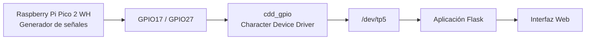
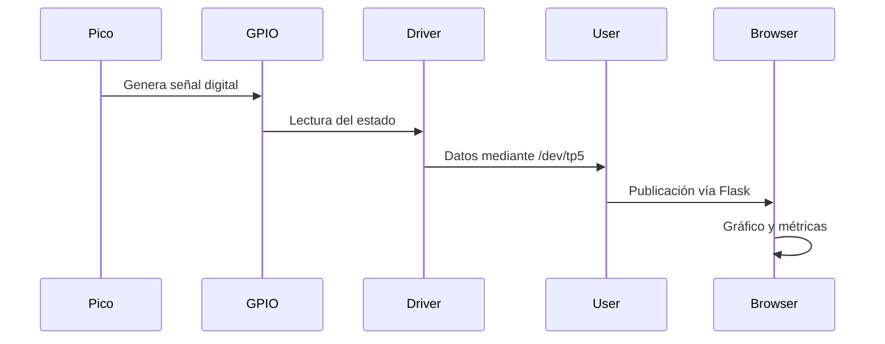

# TP5 - Driver de Caracteres para Monitoreo de Señales GPIO

## Descripción

Trabajo Práctico de **Sistemas de Computación** basado en Linux embebido utilizando una **Raspberry Pi Zero W** y una **Raspberry Pi Pico 2 WH**.

El proyecto implementa un **Character Device Driver (CDD)** que permite leer señales digitales presentes en GPIO de la Raspberry Pi, exponerlas mediante un dispositivo de caracteres (`/dev/tp5`) y visualizarlas a través de aplicaciones en espacio de usuario.

Las señales son generadas por una Raspberry Pi Pico 2 WH y monitoreadas desde una interfaz web desarrollada en Python.

---

## Objetivos

* Desarrollar módulos del kernel Linux.
* Implementar un Character Device Driver.
* Utilizar GPIO desde espacio kernel.
* Comunicar espacio kernel y espacio usuario.
* Desarrollar aplicaciones de monitoreo.
* Integrar hardware, firmware y software.

---

## Arquitectura General



---

## Flujo de Datos



---

## Componentes del Proyecto

### Firmware

La Raspberry Pi Pico 2 WH genera dos señales digitales:

* Canal 1: período de 1 s
* Canal 2: período de 250 ms

---

### Driver del Kernel

El módulo `cdd_gpio`:

* registra dinámicamente un dispositivo de caracteres;
* permite seleccionar el canal mediante `write()`;
* permite leer el estado lógico mediante `read()`;
* expone el dispositivo `/dev/tp5`.

---

### Aplicaciones de Usuario

#### Monitor CLI

Aplicación de consola para:

* lectura continua;
* cálculo de frecuencia;
* cálculo de duty cycle.

#### Interfaz Web

Aplicación Flask que permite:

* selección de canal;
* visualización gráfica;
* medición de frecuencia;
* medición de duty cycle;
* acceso remoto desde navegador.

---

## Estructura del Repositorio

```text
TP5
├── clone_kernel.sh
├── docs/
│   ├── avances.md
│   └── capturas/
├── driver/
│   ├── cdd_basico/
│   ├── cdd_gpio/
│   ├── cdd_loopback/
│   └── hello/
├── firmware/
│   └── signal_generator/
├── kernel-src-6.12.75/
├── toolchain/
│   ├── kernel-export-v2/
│   └── rpi-kernel-headers-v4.tar.gz
├── user/
│   ├── arm_toolchain_test/
│   ├── gpio_monitor_cli/
│   └── webapp/
└── README.md
```

---

## Organización de Directorios

| Directorio               | Descripción                                     |
| ------------------------ | ----------------------------------------------- |
| `docs/`                  | Documentación y capturas                        |
| `driver/`                | Módulos del kernel desarrollados durante el TP  |
| `firmware/`              | Código para la Raspberry Pi Pico 2 WH           |
| `kernel-src-6.12.75/`    | Código fuente del kernel utilizado              |
| `toolchain/`             | Headers y herramientas para compilación cruzada |
| `user/`                  | Aplicaciones en espacio de usuario              |
| `user/gpio_monitor_cli/` | Herramienta de monitoreo por consola            |
| `user/webapp/`           | Aplicación web Flask                            |

---

## Hardware Utilizado

### Raspberry Pi Zero W

* Sistema operativo Linux
* Ejecución del driver
* Aplicaciones de monitoreo

### Raspberry Pi Pico 2 WH

* Generación de señales digitales
* Señales de prueba para validación

---

## Estado Actual

* Driver GPIO funcional
* Lectura de dos canales digitales
* Aplicación CLI funcional
* Aplicación Web funcional
* Medición de frecuencia
* Medición de duty cycle
* Visualización gráfica en tiempo real
